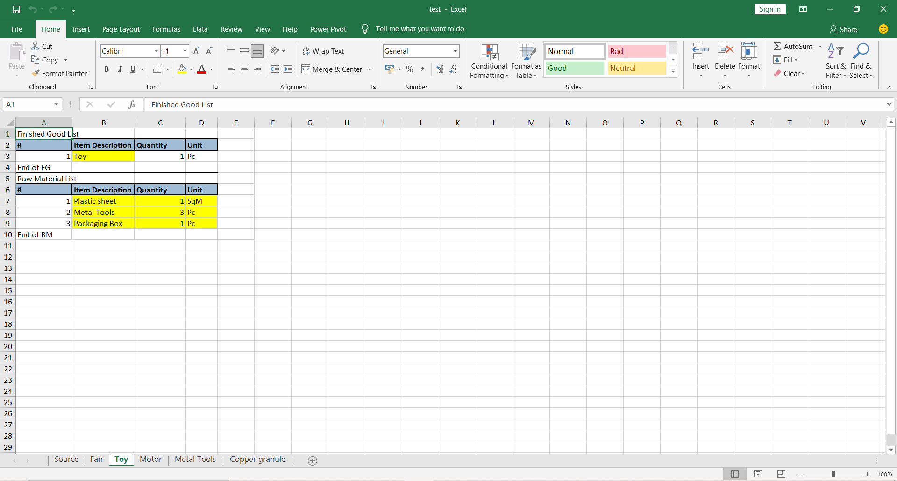

# Bill of Mateials

Here, I have made three functions:-
- Read from Excel -> This function reads all details from the source sheet whose name is provided as input to the function and creates python dictionary of them.

- Organise -> - This function organises the dictionary created according to the level of items.
              - It keeps only level 1 items in the main item and creates other dictionary item which have level 2 & 3 in it.

- Write back to Excel -> - This function reads from the dictionary and creates a copy of the fan sheet, make changes in it as required and        then saves it back.
                        - It also clears out the extra details which were copied from the sheet

*******************
After running the code the excel sheet is filled accordingly.

## Explanation of Task to be done.
Bill of Materials

BOM or Bill of Material is a document which says how much raw material will be required to make 1 unit of a finished good. For instance, fans are made of motor, blades, wires, screws etc. So BOM for fan will look as following:

Bom ID: BOM0001
Finished Good: Fan | 1 Pc
Raw Materials:
Motor    | 1 Pc
Blades  | 3 Pc
Screws | 10 Pc
BOM can be single level or multi-level. A multi-level BOM consists for Raw Materials which have further BOM associated with them. For instance, in the above example, Motors are made of Wires and Plates. A multi-level BOM of Fan will look like this:

Bom ID: BOM0002
Finished Good: Fan | 1 Pc
Raw Materials:
Motor    | 1 Pc
Wires | 20 m
Plates | 2 Pc
Blades  | 3 Pc
Screws | 10 Pc
In BOM0002, Motor, Blades and Screws are called Level 1 materials and Wires & Plates are Level 2 materials

In the attached excel sheet, the first sheet or the source sheet contains BOM Details. Column A (Item Name) gives the name of the Finished Good (Fan in above example). Column B (Level) gives the level of the Raw Material. '.1' means level 1 Raw Material. '..2' means Level 2 Raw material which is used to make '.1' Raw Material which is just above it, and so on. Column C (Raw Material) contains the name of Raw Materials. Column D and E contain the required quantity and unit of measurement respectively.